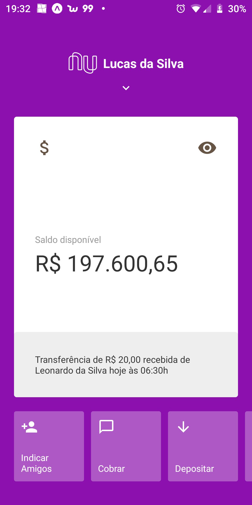
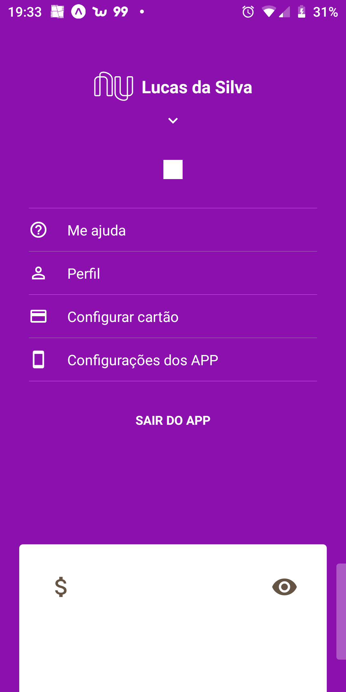

# Cloning the Nubank interface.
## This project uses React Native together with typescrip. In addition, it reproduces the animations of the original application and the opacity effects.
## This Cloning was inspired by the Rocketseat Cloning project that used pure Javascript.

## In the image below you can see the main screen of the application.

## The horizontal scroll bar respects the animation of the original app, moving from right to left.

## When pressing the white box and moving it down, the app menu appears.

#### During production, some errors occurred. In the next version I'll take it out, that's it for now.
